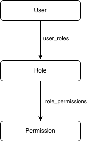

# Access service

Authorization and access control service for the Auth Platform.

The service is responsible for managing roles and permissions and determining which operations are available to a user.

## Overview

auth-access is a backend microservice responsible for authorization and Role-Based Access Control (RBAC).

The service manages the relationship between users, roles, and permissions.

It does not authenticate users and does not issue JWT tokens.

## Responsibilities

The service is responsible for:

- Role management
- Permission management
- Assigning roles to users
- Assigning permissions to roles
- Retrieving user roles
- Retrieving role permissions
- Retrieving all permissions available to a user
- Providing authorization information to the API Gateway

## Authorization Model

The service uses Role-Based Access Control (RBAC).

The basic relationship is

A user does not need to be assigned individual permissions directly.

Instead:

A user is assigned one or more roles.
A role is assigned one or more permissions.
The user's effective permissions are calculated from their roles.

For example:

user -> - user.watch - user.create - user.update

## Permission Model

Permissions represent individual operations that can be performed within the platform.

A permission follows the following naming convention:

resource.action

For example:

user.read
user.write
user.delete

role.read
role.write
role.delete

This naming convention makes permissions explicit and easy to evaluate.

## User Permissions

The service can calculate the complete set of permissions available to a user.

For example:

User: 123

Roles:

- admin
- user

Permissions:

- user.watch
- user.create
- user.delete
- admin.watch
- admin.create

The resulting permission set is returned to the API Gateway, which uses it to determine whether a request should be allowed.

## API Gateway Integration

**auth-access** is primarily consumed by the API Gateway.

The Gateway determines which permission is required for an incoming request and requests the permissions available to the authenticated user.

For example:

GET /users

Required permission:

user.watch

The Gateway then evaluates:

user.watch ∈ userPermissions

If the permission exists, the request is forwarded.

Otherwise, the Gateway returns:

403 Forbidden

## Security

The service follows several security principles:

- Authorization data is isolated from authentication data.
- The database is accessed only by auth-access.
- Other services communicate through gRPC.
- Secrets are managed through HashiCorp Vault.
- Permissions are explicitly defined.
- Access decisions are based on the authenticated user's identity.
- Database queries return distinct effective permissions for a user.
